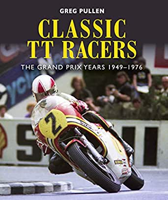
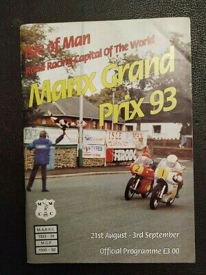
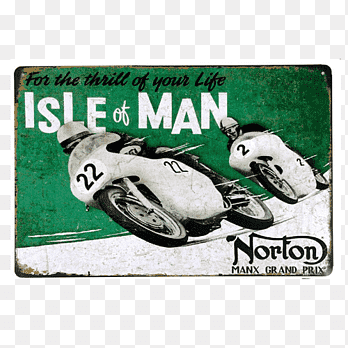

## Ediciones del Campeonato Mundial de Motociclismo
El TT de la Isla de Man formó parte del Campeonato Mundial de Motociclismo desde 1949 hasta 1976. Durante ese período, las carreras en la isla contaron como fecha del Gran Premio del Reino Unido, incluyendo el Sidecar TT, 50cc Ultra-Lightweight TT, 125cc Lightweight TT, 250cc Lightweight TT, 350cc Junior TT y 500cc Senior TT. Después de realizarse las carreras de 1972, el múltiple campeón mundial de motociclismo dominante de su época: Giacomo Agostini, anunció que nunca volvería a competir en la Isla de Man, declarándola demasiado peligrosa para la competición internacional y que era indignante, que tal carrera no debería ser parte de un escenario donde los pilotos eran obligados a hacer dicha carrera. En este punto, el TT de la Isla de Man no era adecuado para el profesionalismo en crecimiento ni para los aspectos comerciales del Gran Premio de Motociclismo. Más y más pilotos se unieron a su boicot, y en 1976 la carrera fue eliminada del campeonato y reemplazada por el Gran Premio de Gran Bretaña.

