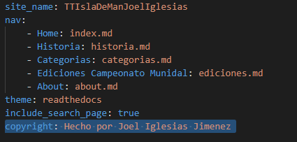

## como hacer el pie de pagina
Pues en el fichero /mkdocs.yml he añadido la siguiente linea: "copyright: Hecho por Joel Iglesias Jimenez" es basicamente un mensaje de copyright personalizado
 
 http://labs.iam.cat/~a16joeigljim/TTIslaDeManJoelIglesias/site/

