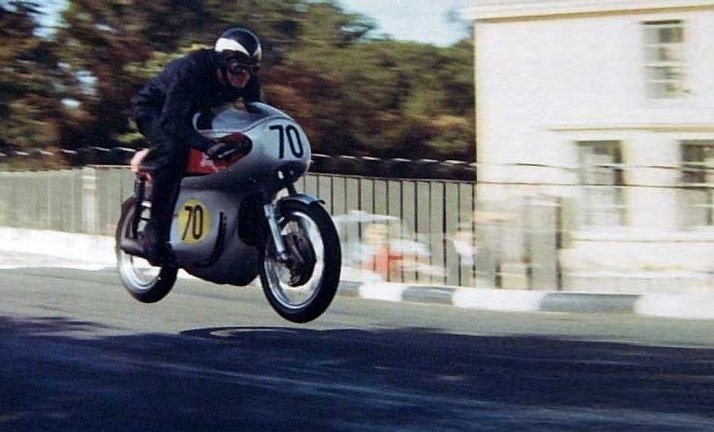
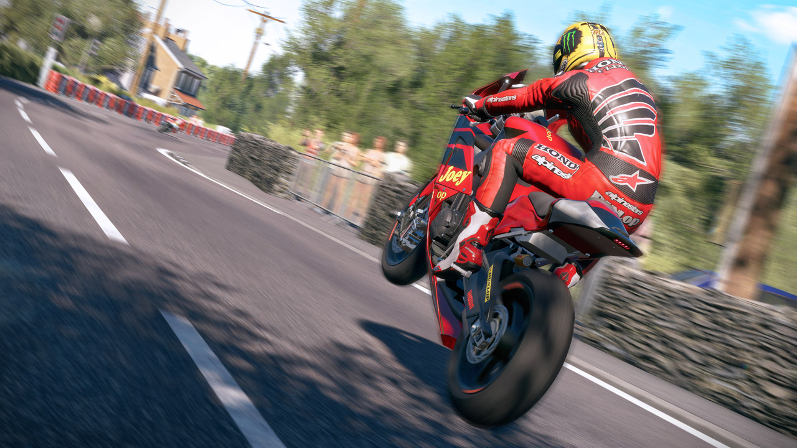

## Categorias
 
## Lightweight
 Actualmente se permiten las motocicletas que conforman dicha categoría son las "Super-Twin" que tienen como especificaciones principales el ser refrigeradas por líquido, ser de 2 cilindros y no tener una capacidad mayor que 650 cm³.

## Superstock
Básicamente motos de serie, con pequeñas modificaciones en la suspensión y en la parte final de los escapes (suelen ser de 1000 cm³)

## Supersport
 Motos más modificadas que las superstock, con modificaciones a nivel de los escapes completos y suspensión delantera. Los motores deben seguir las siguientes especificaciones:

## Lista
- `Entre 400 y 600 cm³`  4 cilindros
- `Entre 500 y 675 cm³`  3 cilindros
- `Entre 600 y 750 cm³`  2 cilindros

## Superbike
Las mismas del campeonato de Superbike y con las mismas especificaciones.

## Senior
 Puede ser básicamente de cualquier especificación, incluso han corrido en la SeniorTT motocicletas de la categoría MotoGP debido a que depende principalmente del criterio de los organizadores para permitir la participación aunque usualmente se corre con la misma motocicleta de la categoría Superbike .

 