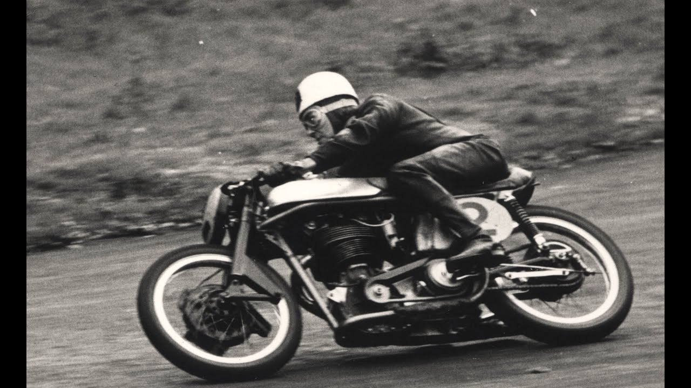

## HISTORIA
La carrera de la clase mayor se denomina Senior TT. Allí competían motocicletas de Gran Premio de hasta 500 cm³, hasta que en 1985 se adoptó el reglamento TT Fórmula 1 y en 2005 las Superbikes de 1000-1200 cm³. En el Senior TT se han destacado Mike Hailwood con siete victorias, John McGuinness con seis y Giacomo Agostini con cinco.

Las demás clases son Superbikes TT (1000-1200 cm³), Superstock TT (1000-1200 cm³), Supersport TT (600-750 cm³), Lightweight TT (650 cm³) y Sidecar TT (600 cm³). En 2010 se creó la clase TT Zero, para motocicletas eléctricas.

La primera carrera tuvo lugar el 28 de mayo de 1907 sobre un recorrido de 10 vueltas a un circuito de unos 25,5 kilómetros. El vencedor de esta primera edición en la categoría de un cilindro (y a la vez ganador total) fue Charlie Collier que pilotando una Matchless realizó el recorrido en 4 horas, 8 minutos y 8 segundos logrando una velocidad media de 61,5 km/h. El vencedor en la categoría de dos cilindros fue Rem Fowler que pilotando una Norton3​4​ con motor Peugeot completó el circuito en 4 horas, 21 minutos y 52 segundos, por lo que tuvo una velocidad media de 58,3 km/h.

El trofeo otorgado al ganador de esa primera edición fue donado por el Marqués de Mouzilly y representa al dios Hermes. El trofeo actualmente le es otorgado el vencedor de la categoría Senior.

En la actualidad (2019) se considera una de las carreras más veloces y peligrosas del motociclismo, con más de 250 muertos5​ a través de su historia y con promedios de velocidad superiores a los 200 km/h (por ejemplo, 208 km/h por John McGuinness en la categoría Senior)6​ y velocidades pico de 332 km/h.7​

